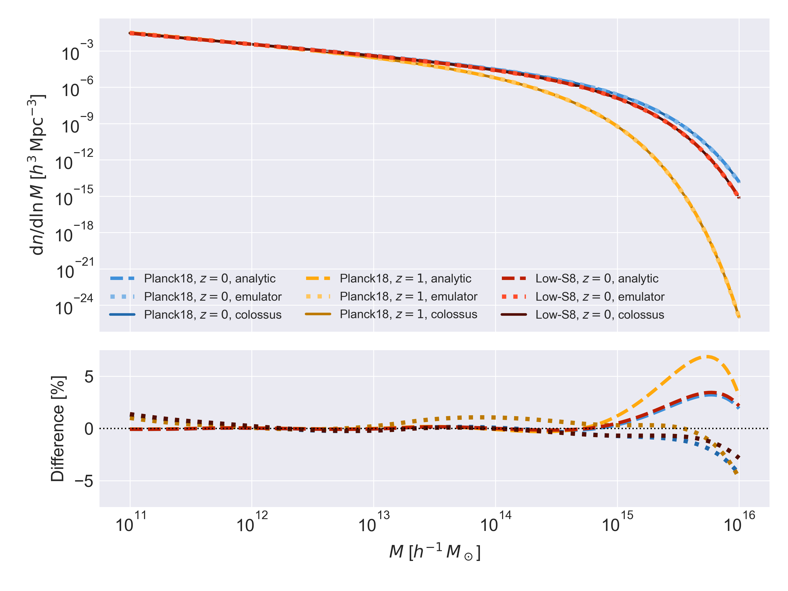

# Summary

Dark matter halos are fundamental structures in cosmology, forming the gravitational potential wells hosting galaxies and clusters of galaxies.
Their properties and statistical distribution (including the halo mass function) are invaluable tools to infer the fundamental properties of the Universe.
The `halox` package is a JAX-powered Python library enabling differentiable and accelerated computations of key properties of dark matter halos, and of the halo mass function.
The automatic differentiation capabilities of `halox` enable its usage in gradient-based workflows, *e.g.* in efficient Hamiltonian Monte Carlo sampling or machine learning applications.
The acceleration capabilities of `halox` enable significant speedups over existing packages such as `colossus` on GPU architectures, while offering comparable performance on CPUs.

# Statement of need

In cosmology and astrophysics, modeling dark matter halos is central to understanding the large-scale structure of the Universe and its formation.
This has motivated the development of many toolkits focused on halo modeling, such as, *e.g.*, halofit [@Smith:2003], halotools [@Hearin:2017], colossus [@Diemer:2018], or pyCCL [@Chisari:2019].
Recently, the AI-driven advent of novel computational frameworks such as JAX [@Bradbury:2018] has led to the development of differentiable and hardware-accelerated software to simulate and model physical processes, with *e.g.* Brax [@Brax:2021] and JAX, MD [@Jaxmd:2020].
The increasing complexity of cosmological data and astrophysical models has motivated the wide adoption of this framework in cosmology, where JAX-powered software has been published to address a wide variety of scientific goals, including
modeling fundamental cosmological quantities, with, *e.g.*, JAX-cosmo [@Campagne:2023] and LINX [@Giovanetti:2024];
simulating density fields and observables, with, *e.g.*, SHAMNet [@Hearin:2022], DISCO-DJ [@Hahn:2024], JAXpm [@Jaxpm:2025], and JAX-GalSim [@Mendoza:2025; @JaxGalSim:2025];
emulating likelihoods for accelerated inference, with, *e.g.*, CosmoPower-JAX [@Piras:2023] and candl [@Balkenhol:2024];
or modeling various physical properties of dark matter halos, such as mass accretion history [Diffmah, @Hearin:2021], galaxy star formation history [Diffstar, @Alarcon:2023], halo concentration [Diffprof, @Stevanovich:2023], gas-halo connection [picasso, @Keruzore:2024], and halo mass function [@Buisman:2025]^[Note that halox also provides an implementation of the halo mass function, but chooses a lighter, halo model-based approach; see **Features**.].

The `halox` library offers a JAX implementation of some widely used properties which, while existing in other libraries focused on halo modeling, do not currently have a publicly available, differentiable and GPU-accelerated implementation, namely:

* Radial profiles of dark matter halos following Navarro-Frenk-White [@Navarro:1997] and Einasto [@Einasto:1965] distributions;
* Concentration-mass relations
* The halo mass function, quantifying the abundance of dark matter halos in mass and redshift, including its dependence on cosmological parameters;
* The halo bias.

The use of JAX as a backend allows these functions to be compiled and GPU-accelerated, enabling high-performance computations; and automatically differentiable, enabling their efficient use in gradient-based workflows, such as sensitivity analyses, Hamiltonian Monte-Carlo sampling for Bayesian inference, or machine learning-based methods. In addition, expensive computations of large-scale structure properties are further accelerated using neural network emulators, preserving hardware acceleration and differentiability while enabling faster calculations thanks to approximate calculations (see the **Emulation** section).

# Features

## Available physical quantities

The `halox` library seeks to provide JAX-based implementations of common models of dark matter halo properties and of large-scale structure.
At the time of writing (software version 2.0.1), this includes the following properties:

* Cosmological quantities: `halox` relies on JAX-cosmo [@Campagne:2023] for cosmology-dependent calculations, and includes wrapper functions to compute some additional properties, such as critical density $\rho_{\rm c}$ and differential comoving volume element ${\rm d}V_{c} / {\rm d}\Omega {\rm d}z$.
* Radially-dependent physical properties of NFW and Einasto dark matter halos. Our NFW and Einasto implementations are based on the analytical derivations of @Lokas:2001 and @Retana-Montenegro:2012 respectively, and include the following quantities:
  * Matter density $\rho(r)$;
  * Enclosed mass $M(\leq r)$;
  * Gravitational potential $\phi(r)$;
  * Circular velocity $v_{\rm circ}(r)$;
  * Velocity dispersion $\sigma_{v}(r)$ (NFW only);
  * Projected surface density $\Sigma(r)$ (NFW only).
* Concentration-mass relations: There are implementations of several relations including:
  * @Duffy:2008
  * @Klypin:2011
  * @Prada:2012
  * @Child:2018 (for all halo and relaxed halo populations)
* Large-scale structure: Building upon the power spectra computations implemented in JAX-cosmo, `halox` provides implementations of the RMS variance of the matter distribution in spheres of radius $R$, $\sigma(R)$. It also includes a wrapper function to perform the computation within the Lagrangian radius of a halo of mass $M$, $\sigma(M)$.
* Halo mass function (HMF): The HMF model of @Tinker:2008, predicting ${\rm d}N / {\rm d} \ln M$ as a function of halo mass $M$, redshift $z$, and cosmology.
* Halo bias: The linear bias model of @Tinker:2010 as a function of halo mass $M$, redshift $z$, and cosmology.
* Overdensities: All properties in `halox` can be computed for spherical overdensity (SO) halo masses defined for any critical overdensity value. Convenience functions are provided to convert halo properties from one critical overdensity to another, or to convert critical overdensities to mean matter overdensities.

## Emulation

$\sigma^2(R)$ is the variance of the fluctuations of the matter density field in a sphere of radius $R$, given by:

$$\sigma^2(R,z,\Omega) = \frac{1}{2 \pi^2} \int_0^\infty k^2 W^2(k, R) P(k, z, \Omega) {\rm d}k,$$

where $z$ denotes redshift, $\Omega$ cosmological parameters, and $k$ spatial frequency; $P(k,z,\Omega)$ is the power spectrum, and $W$ is the Fourier transform of the spherical top-hat window function.
$\sigma$ is an essential ingredient in computing both halo mass function and halo bias in most standard parameterizations [*e.g.*, @Tinker:2010], and the numerical integration is computationally expensive, and often the primary bottleneck in such calculations.

To tackle this issue, `halox` also includes an emulated calculation of $\sigma$, as a function of mass (the Lagrangian mass contained in a radius $R$), redshift, and cosmological parameters.
Our emulator consists of a multi-layer perceptron with three hidden layers, each of width 64.
The emulator was trained on the halox $\sigma(M)$ implementation.
The training set is taken from a Sobol sample over log(M), log(1+z), and the cosmological parameters $\Omega_b$, $\Omega_c$, $h$, $n_s$, and $\sigma_8$.

The emulator is accurate to within a percent for both $\sigma(M)$ and the halo bias, and within a few percent for the HMF across the tested parameter space.
\autoref{fig:figure1} and \autoref{fig:figure2} show the accuracy of emulator-based predictions of $\sigma(M)$ and of the halo mass function for different cosmologies up to $z=1$, demonstrating remarkable accuracy, with an increase of error in the regime of extremely massive halos ($M_{200c} > 10^{15} \, h^{-1} M_\odot$), which are very rare occurences in both simulations and observations.

{#fig:figure1 width="90%"}

{#fig:figure2 width="90%"}

To compute $\sigma(M)$, the HMF, or the halo bias using the emulator, users may simply instantiate the emulator, then pass it in as an optional argument to the original $\sigma(M)$ function in halox:

```py
emu = emus.sigmaM.SigmaMEmulation()               # instantiate emulator
sigma_a = halox.lss.sigmaM(M, z, cosmo)           # analytic sigma(M)
sigma_e = halox.lss.sigmaM(M, z, cosmo, emu=emu)  # emulated sigma(M)
```


## Automatic differentiation and hardware acceleration

All calculations available in `halox` are written using JAX and JAX-cosmo.
As a result, all functions can be compiled just-in-time using `jax.jit`, hardware-accelerated, and are automatically differentiable with respect to their input parameters, including halo mass, redshift, and cosmological parameters.
In addition, all JAX transformations can be used on `halox` functions, including native vectorization and parallelization using *e.g.* `jax.vmap`.


# Speedup

\autoref{fig:figure3} shows the performance of halo mass function computations in `halox` across hardware configurations, benchmarked against our slowest evaluation (analytical computation on CPU).
For comparison, we also compare to the performance of `colossus` on the same computation^[ Our benchmarks were run on an AMD EPYC 7742 CPU (2.25GHz) and an NVIDIA A100-SXM4-40GB GPU, evaluating the HMF on a grid of 256 halo masses $\times$ 256 redshifts, for a fixed cosmology.  All `halox` computations were run after just-in-time compilation.].
Three results stand out.
First, we see that `colossus` outperforms `halox` on CPU, by about a factor of three for the analytic computation, owing to calls to highly efficient libraries such as CAMB [@Lewis:2011] and well-optimized interpolation and integration schemes.
Second, using a GPU significantly accelerates `halox` predictions, by a factor of over 20 for the analytic computation, and of about 65 for the emulated version.
Third, using the neural network emulator as a backend for the $\sigma(M)$ computation enables a substantial speedup, up to $95\times$ compared to baseline, and $34\times$ compared to `colossus`.
These results demonstrate the strong potential of `halox` in GPU-based cosmological analyses, delivering considerable speedup in addition to automatic differentiation.
We also note that all computations were made at double (FP64) precision; `halox` can be further accelerated, in particular on GPUs, by dropping to single (FP32) precision.


# Validation

All functions available in `halox` are validated against existing, non-JAX-based software.
Cosmology calculations are validated against Astropy [@Astropy:2022] for varying cosmological parameters and redshifts.
Other quantities are validated against either `colossus` [@Diemer:2018] or Gala [@Gala:2017] for varying halo masses, redshifts, critical overdensities, and cosmological parameters.
These tests are included in an automatic CI/CD pipeline on the GitHub repository, and presented graphically in the online documentation.

# Acknowledgments

We would like to thank Lindsey Bleem, Andrew Hearin, Matt Becker, and Georgios Zacharegkas for useful discussions and feedback on `halox` and on this manuscript.
This work was supported in part by the U.S. Department of Energy, Office of Science, Office of Workforce Development for Teachers and Scientists (WDTS) under the Science Undergraduate Laboratory Internships (SULI) Program.
Argonne National Laboratory’s work was supported by the U.S. Department of Energy, Office of Science, Office of High Energy Physics, under contract DE-AC02-06CH11357.

**AI usage disclosure**
We acknowledge the use of Anthropic's Claude (Sonnet 4.5, Opus 4.5, Opus 4.6) in the development of `halox` (code and documentation).
We note that no AI was used in writing the unit test suite enforcing accuracy of the software.

# References

